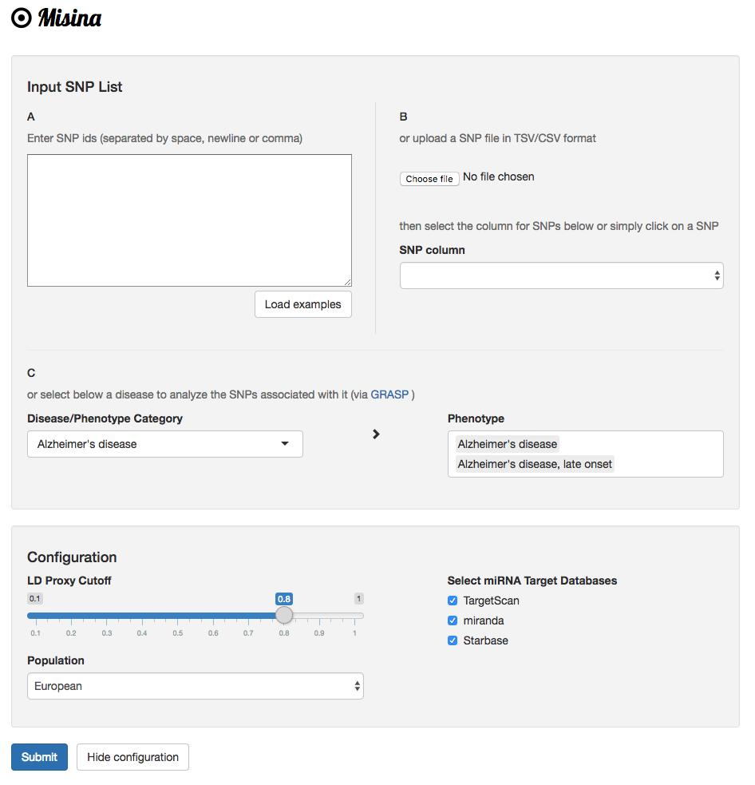

## Misina: Finding microRNA-mediated effects of genetic variants with an integrative approach

- Misina provides easy-to-use analysis for non-expert researchers seeking to investigate miRNA-mediated effects of genetic variants.
- It ranks SNPs residing in miRNA binding sites of target genes using an integrative approach. 
- Risk SNPs can be extended by those in high linkage disequilibrium. 
- We integrate SNPs with experimentally validated as well as two predicted miRNA target data sets. Resulting SNP/miRNA pairs were further integrated with known annotations and overlapped with expression Quantitative Trait Loci (eQTL) studies. 
- The integration of human miRNA expression datasets enables the examination of miRNA expression in relevant tissues. 
- The scoring scheme ranks identified SNP-miRNA pairs based on three criteria: seed type, relative position of SNP in the binding site and overlap of miRNA target and eQTL gene.
